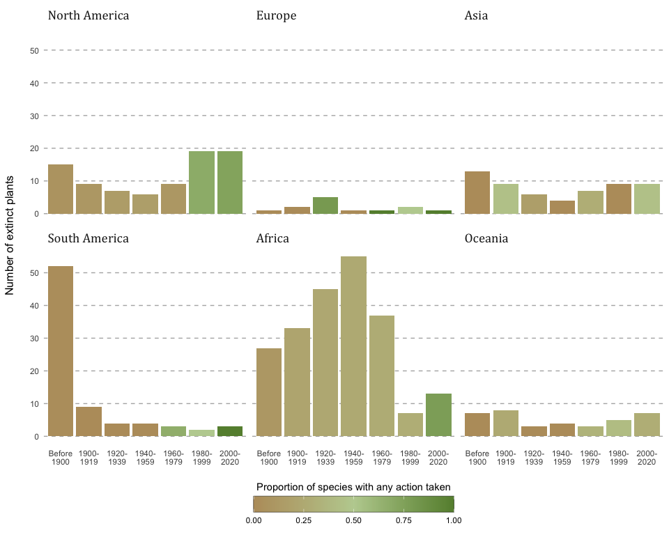
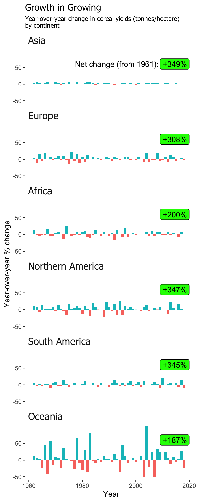

# tidy-tuesday

Here is a collection of the code and plots produced for the [#TidyTuesday](https://github.com/rfordatascience/tidytuesday) project. Click on each plot for the code used to produce it.

### Week 34 - Plant Extinctions

### Week 36 - Global Crop Yields
